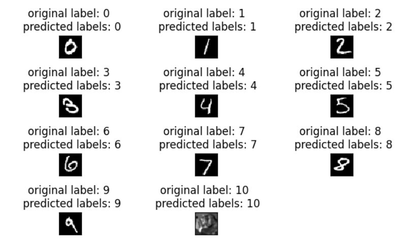

# Deep-Learning-Project--Open-Set-Recognition
•The Open Set Recognition (OSR) challenge, requiring the model (trained exclusively on MNIST) to classify out-of-distribution images as an unknown class rather than forcing an incorrect classification.  

•Implemented a solution using Python and the PyTorch framework. Utilized a Neural Network for feature extraction and the K-Means algorithm.

